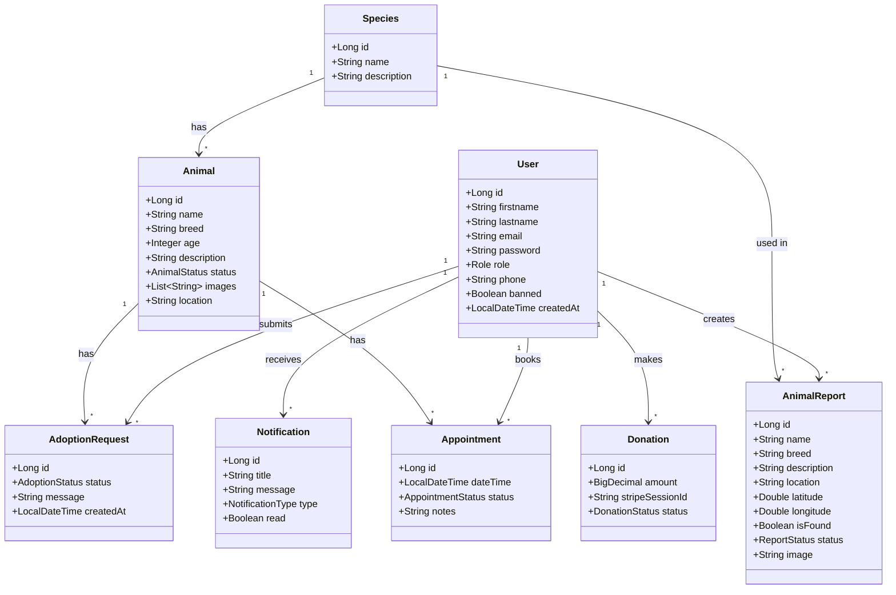
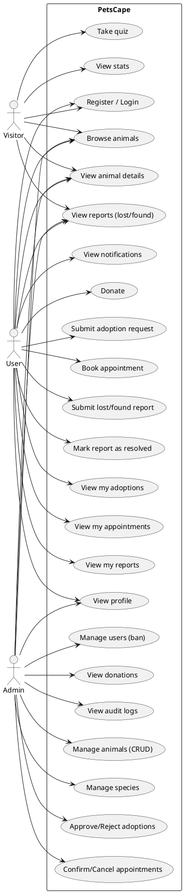

# PetsCape — UML & Use Cases

## 1. Class diagram (Mermaid)

Paste the code below into **Mermaid Live Editor**  
https://mermaid.live  

or any tool that supports Mermaid (e.g. GitHub, GitLab, Notion, VS Code with Mermaid extension).

---

## 2. Use case diagram

Mermaid does not support standard UML use case diagrams (actors, ovals, system boundary). Use one of the options below.

### Option A — PlantUML (recommended)

1. Open **PlantUML online**: https://www.plantuml.com/plantuml/uml/
2. Paste the code below.
3. Export as PNG/SVG or copy the image.

### Option B — Draw.io (diagrams.net)

1. Open https://app.diagrams.net/ (or https://www.draw.io/)
2. Create a new diagram and choose **UML** or blank.
3. From the left shape library, add **UML** → **Use case** (actor stick figure, oval use cases, rectangle system boundary).
4. Draw:
   - **Actors:** Visitor, User, Admin (outside the system rectangle).
   - **System boundary:** one rectangle labeled “PetsCape”.
   - **Use case ovals** inside the boundary (see list below).
   - **Associations:** lines between actors and use cases they can perform.

### Use cases to include (for Draw.io or any tool)

| Actor   | Use case |
|---------|----------|
| Visitor | Browse animals, View animal details, View lost/found reports, View stats, Take quiz, Register, Login |
| User    | All visitor use cases + View profile, Submit adoption request, Book appointment, Submit lost/found report, Mark report as resolved, View my adoptions, View my appointments, View my reports, View notifications, Donate |
| Admin   | All user use cases + Manage animals (CRUD), Manage species, Approve/Reject adoptions, Confirm/Cancel appointments, Manage users (ban), View donations, View audit logs |

---

## 3. Quick reference — Mermaid class diagram only

If you only need the **class diagram** and want to render it quickly:

- **Mermaid Live:** https://mermaid.live → paste the Mermaid code from section 1 → export PNG/SVG.

No account required; the diagram is generated in the browser.
